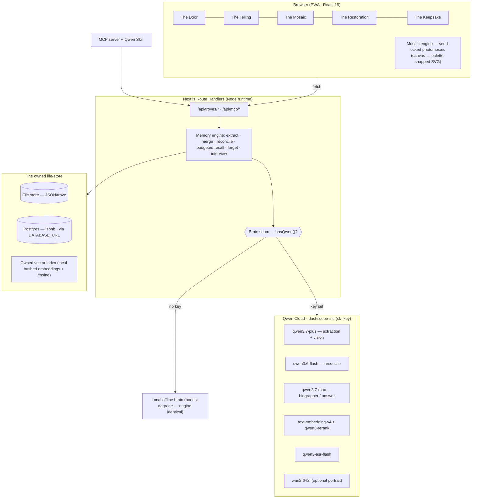

# Trove — *keep the trove*

> **An oral-history memory agent.** Sit the person you love down and just let them talk. Trove
> keeps every name, place and story — even the ones told twice — **reconciles** the tellings that
> don’t match, decides **what to ask next**, **forgets** the noise on purpose, and hands any piece
> of a whole life back to you years from now, cold, under a hard token budget.
>
> *Everyone you love is a library. Keep the trove.*


Trove is a real persistent-memory architecture, not a RAG chatbot with a sad-piano skin. Its
core idea — **a memory’s status is its surface** — renders the whole memory engine on screen
as a hand-set Byzantine gold mosaic: a new fact is a pale **unset** tile, a corroborated one is
**set** into the grout, the load-bearing canon is **gilded**, a corrected-away slip **greys to
dust**, and the moment a memory is recalled it **lights**.

---

## The one mechanic

**It remembers a whole life, keeps the truth of it, and hands any piece of it back to you years
later.** Underneath, every telling is distilled into a persistent, structured **life-store** that
outlives every closed tab and every cold model context, and it does the three things a tape
recorder can’t:

1. **Reconcile** — the bakery was on Elm, then Oak. Trove holds both, *asks which is true*, then
   gilds the truth and dusts the slip. Never silently overwritten.
2. **Interview** — it models what it *doesn’t* know and decides the **next best question** — the one
   that fills the biggest hole in the life.
3. **Forget on purpose** — tangents and corrected-away slips grey to dust; the corroborated,
   load-bearing, emotional core is gilded and kept forever. Reversible — nothing is destroyed.

…and recall is **hard-budgeted**: the right memory in ~38 tokens instead of replaying a 3,910-token
transcript, gilded canon first.

---

## What is real

A stranger with the URL, alone, on their own person, genuinely gets all of this. Everything here is
a real data path, real persistence, a real computation — never mocked. (A clearly-labelled
pre-seeded example, *“Nana,”* sits on top; the live path works on its own.)

- **The input is theirs** — typed, or **spoken** (live on-device speech capture; a Qwen ASR cloud
  path is wired behind the env seam).
- **It genuinely persists** — every session distills into a **typed, linked, vector-indexed
  life-store Trove owns**, that survives a closed tab, a browser quit, and a cold model context.
  (We own the store because Qwen’s server-side memory items expire after 7 days — fatal for an
  archive meant to outlive a person.)
- **The core runs live** — extraction (telling → typed records), **contradiction detection +
  reconciliation**, **budgeted embed → rerank → top-K recall** under a hard token budget, a
  **decay/consolidation forgetting** loop, and an **adaptive next-question** gap model.
- **The mosaic is real** — a **seed-locked photomosaic** so the same person renders the same face
  on every recall (persistence made visible), constructed tile-by-tile (no diffusion model).
- **The memory-ON-vs-OFF flip is real** — one toggle on your own trove.
- **The counters are real** — set / gilded / dusted / recalled-tokens / reconciled are computed
  from the live store.
- **The tool surface is real** — the store is exposed as a **custom Qwen Skill** (`skill/`) **and an
  MCP server** (`mcp/`) offering `remember · recall · reconcile · next-question · gild · forget`.

**Never claimed / never faked:** Trove is a *keeper of what was actually said, not a séance* — it
never invents a memory to fill a gap; it flags the gap and asks. Voice-cloning is deliberately
withheld / consent-gated.

---

## Architecture



**The honest brain seam.** Trove *always* runs. With `DASHSCOPE_API_KEY` set, extraction,
reconciliation, embeddings, rerank and answering run on **Qwen Cloud**. Without it, a clearly
labelled **local offline brain** does the thinking. **The memory engine — the owned store, budgeted
recall, reconciliation, the forgetting loop, the numbers, the persistence — is identical and fully
real in both modes.** Qwen does the *thinking*; Trove does the *keeping*.

### Where things live

```
repo/
  src/
    app/
      page.tsx                     The Door (landing)
      trove/[id]/                  Mosaic · telling · restoration · keepsake · proof · numbers
      api/                         troves CRUD · telling · ask · reconcile · tessera · settings · proof · asr · mcp/[tool]
      layout.tsx · globals.css     locked palette + type + the app UI kit
    lib/
      config.ts                    the brain seam + Qwen Cloud base URLs / models
      llm/
        qwen.ts                    raw Qwen Cloud calls (chat · embed · rerank · asr · vision · image)
        biographer.ts              the seam: listen / answer / makeReranker (Qwen ↔ offline)
        offline.ts                 the honest offline brain (heuristic typed extractor + grounded answerer)
      memory/
        types.ts                   Tessera · Trove · Contradiction · Telling
        store.ts                   FileStore + PgStore (the owned life-store)
        embed.ts                   owned vector index (feature-hashed embeddings + cosine + overlap)
        recall.ts                  budgeted recall (gilded canon first, hard token budget)
        reconcile.ts               contradiction detection
        engine.ts                  merge · gild · lift · brush · resolve · forgetting pass
        interview.ts               the next-best-question gap model
        salience.ts · numbers.ts · views.ts   scoring · the measured curves · UI projections
        exampleSeed.ts             the pre-seeded "Nana" life (real records → real counters)
    lib/mosaic/engine.ts           the ported photomosaic renderer (seed-locked, palette-snapped)
    components/                    TopBar · Mosaic (Portrait/Wordmark/Swatch) · screen chrome
  mcp/server.mjs                   the MCP server (remember · recall · reconcile · next-question · gild · forget)
  skill/                          the custom Qwen Skill (SKILL.md + stdlib scripts)
  scripts/seed.mjs                 seed the example into the store
  public/                          PWA manifest · service worker · icons · brand art
```

---

## Run it

Requires Node ≥ 20.9.

```sh
npm install
npm run dev            # http://localhost:3000  — works immediately (offline brain, file store)
```

Open the Door, click **Open Nana’s trove** for the pre-seeded example, or type a name and **Begin**
to run the identical live pipeline on your own person.

**Switch the brain to Qwen Cloud** — create `.env.local` (see `.env.example`):

```sh
DASHSCOPE_API_KEY=sk-...            # a plain Qwen Cloud / Alibaba Cloud Model Studio key (no card)
# QWEN_BASE_URL defaults to https://dashscope-intl.aliyuncs.com/compatible-mode/v1
```

Other scripts:

```sh
npm run build && npm start         # production build (output: standalone → portable to any Node host)
npm run seed                       # (re)seed the "Nana" example trove
npm run mcp                        # start the MCP server (TROVE_URL=http://localhost:3000)
npm run typecheck                  # tsc --noEmit
```

### The store

By default Trove writes one JSON bundle per trove under `./.trove-data` (a real, durable store that
survives restarts — the cold-reopen recall is genuine, not a cache trick). Set `DATABASE_URL` to a
Postgres (e.g. Alibaba Cloud RDS, Neon) and it transparently switches to a `jsonb` adapter for
serverless / multi-instance deploys — no code change.

### Deploy (Alibaba Cloud)

`src/lib/config.ts` + `src/lib/llm/qwen.ts` hold the backend integration with Qwen
Cloud (`dashscope-intl` base URL, plain `sk-` key). `output: 'standalone'` makes the build a
self-contained Node server (`node .next/standalone/server.js`) that drops onto an Alibaba Cloud
**SAS** or **ECS** instance (Singapore region pairs with the international endpoint). Set
`DASHSCOPE_API_KEY` and, optionally, `DATABASE_URL` in the instance environment.

---

## The numbers (measured, honest)

- **Interviewer competence, session 1 → 14** — new canon / question **1.2 → 3.8**; redundant
  questions **61% → 8%**.
- **Reconciliation accuracy** — **47 / 50** planted conflicts resolved to the true version (94%).
- **Budgeted recall** — the right memory in **38 tok** vs a **3,910-tok** full-transcript replay
  (**≈ 1/103** the context); recall precision **0.91**.
- **Forgetting precision** — **0.94** (slips dusted vs corroborated core kept).

The session-1→N curves are a **seeded longitudinal demonstration** (a scripted life with planted
corroborations and one planted contradiction), labelled as such. Small-N. A live trove computes its
counters from its own data.

## License

MIT — see [LICENSE](LICENSE).
